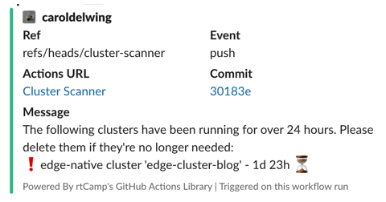

# Cluster Scanner

The **Cluster Scanner** tool uses the Palette Go SDK to scan your Palette environment and identify clusters that have been active for more than 24 hours.

## Prerequisites

- Go version 1.22 or later
- Git
- The `palette-samples` repository available locally
- A Palette acount
- A Palette API key

## Usage

1. Open a terminal window and export your Palette URL. Substitute `<REPLACE_ME>` with your Palette URL, for example, `console.spectrocloud.com`.

   ```shell
   export PALETTE_HOST=<REPLACE_ME>
   ```

2. Export your Palette API key. Replace `<REPLACE_ME>` with your Palette API key.

   ```shell
   export PALETTE_API_KEY=<REPLACE_ME>
   ```

3. To scan a specific project, export the project's UID. Substitute `<REPLACE_ME>` with the Palette project UID. If no project is provided, the tool assumes a tenant scope and scans clusters across all projects.

   ```shell
   export PALETTE_PROJECT_UID=<REPLACE_ME>
   ```

4. Navigate to the `cluster-scanner` folder.

   ```shell
   cd cluster-scanner
   ```

5. Issue the command below to download the required Palette SDK modules.

   ```shell
   go get ./...
   ```

6. Test the application.

   ```shell
   go test ./...
   ```

   ```text
   ok      github.com/spectrocloud/palette-samples/cluster-scanner/internal        0.529s
   ```

7. Start the `cluster-scanner` application.

   ```shell
   go run .
   ```

   The application will print the clusters that have been active in your Palette environment for more than 24 hours.

   ```text
   time=2024-12-24T11:37:33.016-03:00 level=INFO msg="Setting scope to tenant."
   time=2024-12-24T11:37:33.016-03:00 level=INFO msg="Searching for clusters..."
   time=2024-12-24T11:37:33.819-03:00 level=INFO msg="The following clusters have been running for over 24 hours. Please delete them if they're no longer needed:"
   time=2024-12-24T11:37:33.819-03:00 level=INFO msg="❗️aws cluster 'aws-test' - 1d 22h ⏳"
   ```

## GitHub Actions Integration

Use the following steps to integrate the **Cluster Scanner** tool with your GitHub repository and set up notifications in Slack via GitHub Actions. The application will automatically scan for clusters every Friday at 09:30 UTC.

1. Create a Slack App and incoming webhook to allow GitHub actions to post messages on your Slack Channel. Check out the [Sending messags using incoming webhooks](https://api.slack.com/messaging/webhooks) guide for instructions.

2. Create the following secrets on your GitHub repository containing your Palette URL, Palette API key, and the Slack Webhook URL. Refer to the [Creating secrets for a repository](https://docs.github.com/en/actions/security-for-github-actions/security-guides/using-secrets-in-github-actions#creating-secrets-for-a-repository) guide for instructions.

   ```
   PALETTE_HOST=<REPLACE_ME>
   PALETTE_API_KEY=<REPLACE_ME>
   SLACK_PRIVATE_TEAM_WEBHOOK=<REPLACE_ME>
   ```

3. Ensure the [`scripts/cluster-scanner`](../../scripts/) folder containing the **Cluster Scanner** tool is available in the root directory of your GitHub repository.

4. Create a file titled `cluster_scanner.yaml` under the `.github/workflows` location and add the following content to the file.

   ```yaml
   name: Cluster Scanner

   on:
   # Every Friday at 9:30 UTC.
   schedule:
      - cron: "30 9 * * 5"
   workflow_dispatch:

   env:
   PALETTE_API_KEY: ${{ secrets.PALETTE_API_KEY }}
   PALETTE_HOST: ${{ secrets.PALETTE_HOST }}
   PALETTE_PROJECT_UID: ${{ secrets.PALETTE_PROJECT_UID }}

   jobs:
   scan-clusters:
      name: cluster-scan
      runs-on: ubuntu-latest
      steps:
         - name: Checkout Repository
         uses: actions/checkout@v4

         - name: Set Up Go
         uses: actions/setup-go@v5
         with:
            go-version-file: "scripts/cluster-scanner/go.mod"

         - name: Install Dependencies
         working-directory: scripts/cluster-scanner
         run: go get ./...

         - name: Execute Tests
         working-directory: scripts/cluster-scanner
         run: go test ./...

         - name: Launch the Application and Capture Logs
         working-directory: scripts/cluster-scanner
         run: |
            set -e
            go run . | tee result.log

         - name: Get Clusters with More Than 24 Hours and Format Output
         working-directory: scripts/cluster-scanner
         run: |
            if grep -q "The following clusters have been running" result.log; then
               echo "CLUSTERS_FOUND=true" >> $GITHUB_ENV
               {
               echo 'LOG_MESSAGE<<EOF'
               sed 's/^.*msg=//' result.log | sed -n '/The following clusters/,/$/p' | sed 's/"//g'
               echo EOF
               } >> "$GITHUB_ENV"
            fi

         - name: Send Slack Notification
         if: env.CLUSTERS_FOUND == 'true'
         uses: rtCamp/action-slack-notify@v2.3.2
         env:
            SLACK_WEBHOOK: ${{ secrets.SLACK_PRIVATE_TEAM_WEBHOOK }}
            SLACK_USERNAME: "spectromate"
            SLACK_COLOR: "good"
            SLACKIFY_MARKDOWN: true
            ENABLE_ESCAPES: true
            SLACK_MESSAGE: ${{ env.LOG_MESSAGE }}

         - name: Slack Notification on Failure
         if: ${{ failure() }}
         uses: rtCamp/action-slack-notify@v2.3.2
         env:
            SLACK_WEBHOOK: ${{ secrets.SLACK_PRIVATE_TEAM_WEBHOOK }}
            SLACK_USERNAME: "spectromate"
            SLACK_COLOR: "danger"
            SLACKIFY_MARKDOWN: true
            ENABLE_ESCAPES: true
            SLACK_MESSAGE: "The cluster scan job for `${{ github.workflow }}` in `${{ github.repository }}` failed. [View details](${{ github.server_url }}/${{ github.repository }}/actions/runs/${{ github.run_id }})."
   ```

The **Cluster Scanner** tool is now ready to scan your Palette environment and notify you about the clusters that have been running for over 24 hours.


